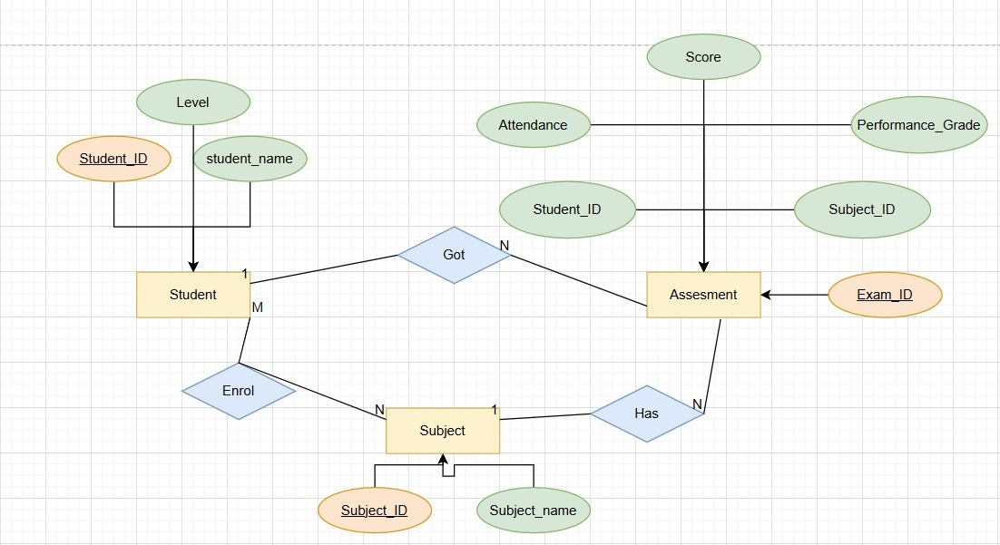
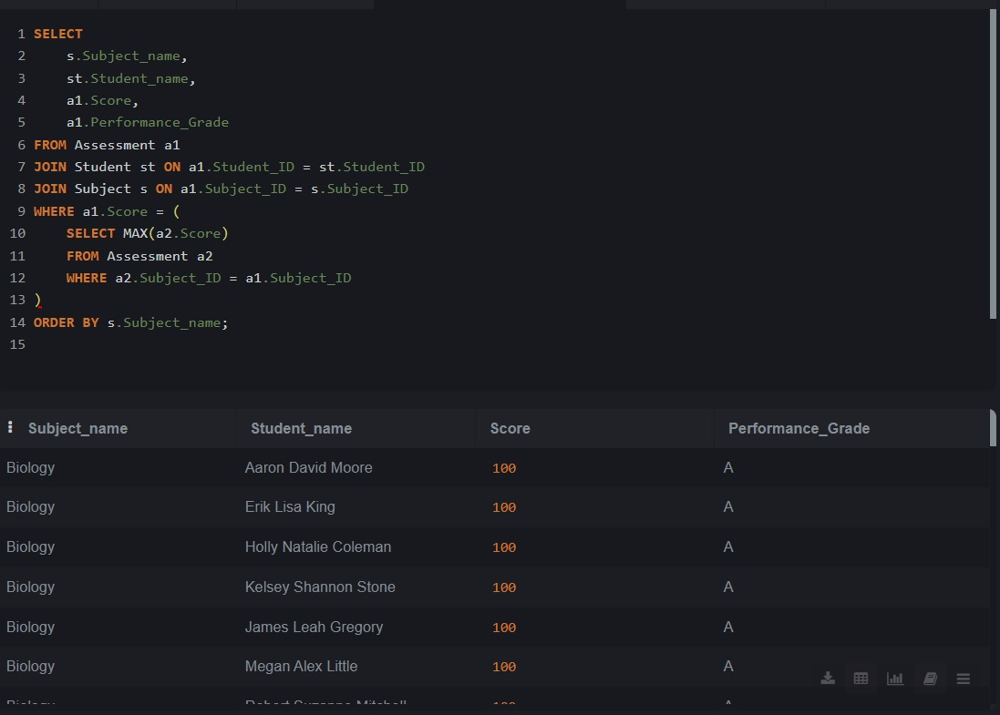
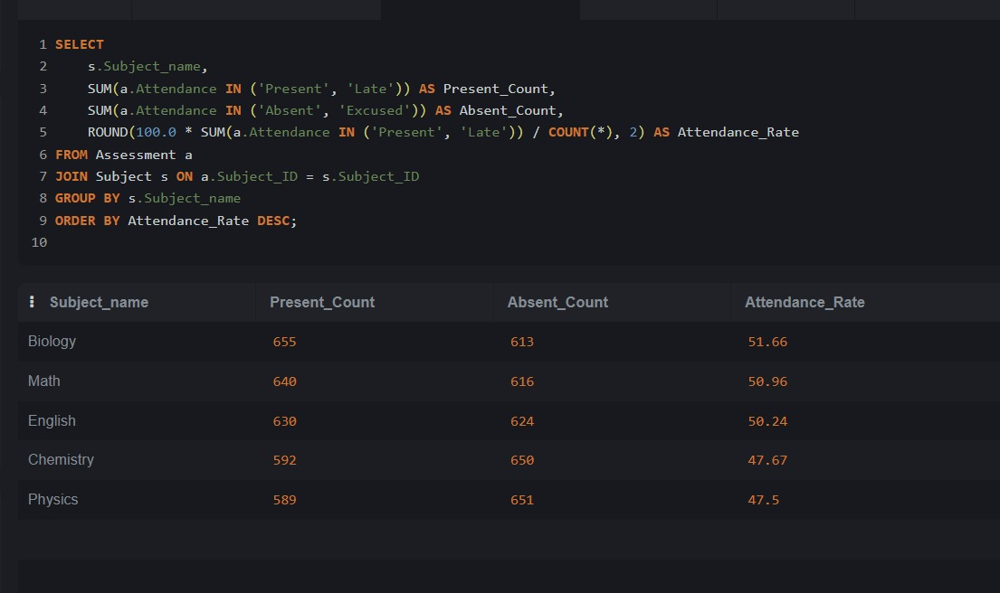
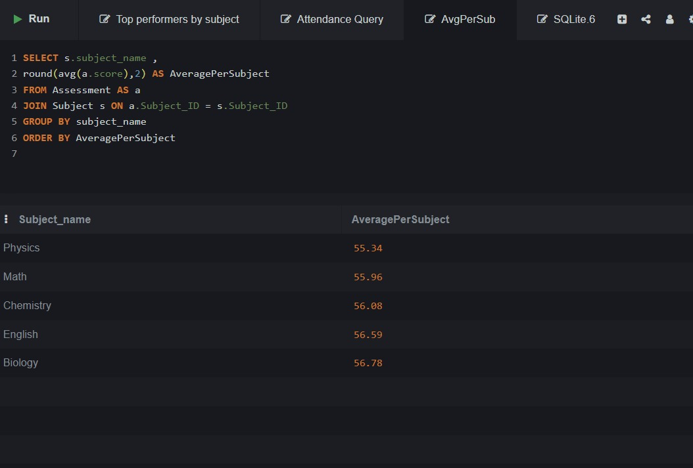
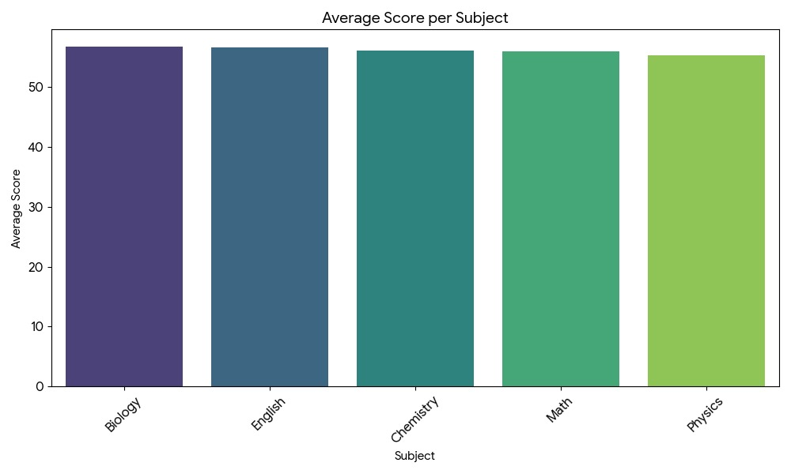
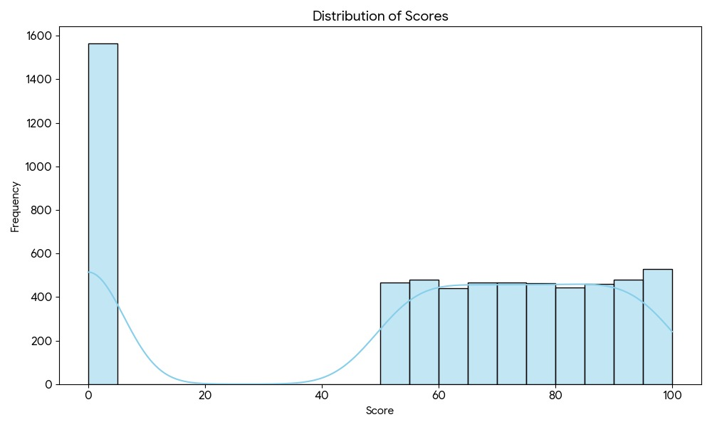
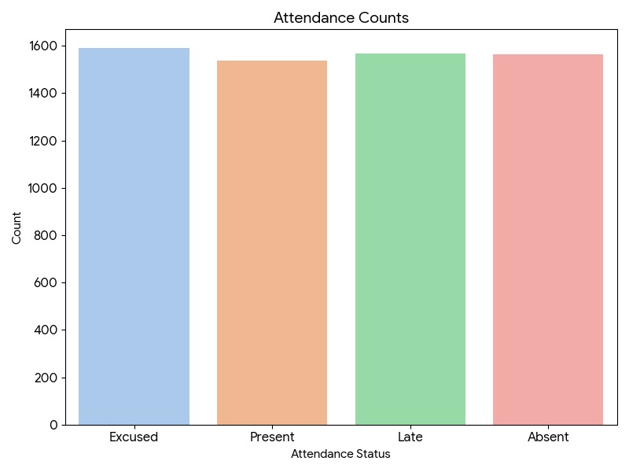
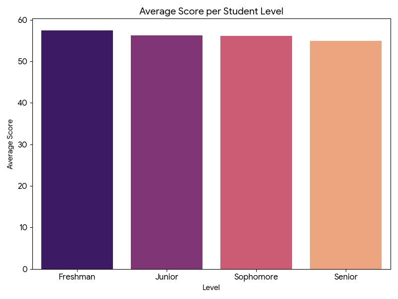
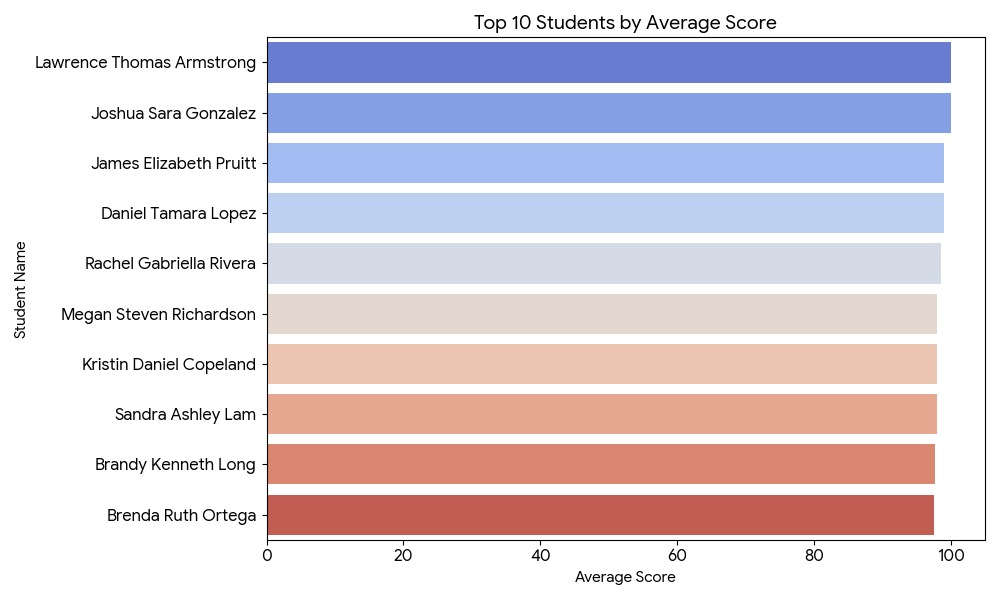
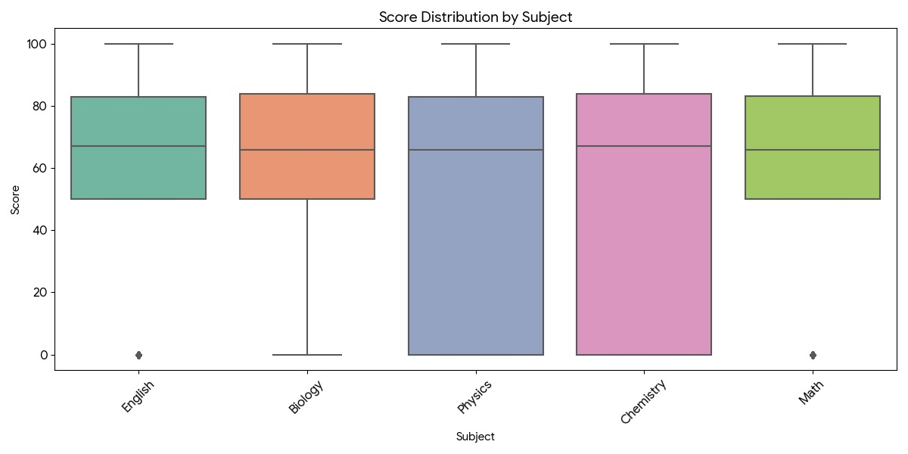

# Student-performance-analysis-system
## 📋 Project Overview

This is a **complete data analytics pipeline** that transforms raw student academic data into actionable insights through ETL processing, database normalization, SQL analysis, and professional visualizations.

**Core Objective:** Enable educational administrators to identify performance gaps, evaluate curriculum difficulty, and recognize top achievers through data-driven decision-making.

**Key Value Proposition:**
- 🎯 **Identify at-risk students** through attendance and score anomalies
- 📈 **Evaluate subject difficulty** using statistical aggregations
- 🏆 **Recognize high performers** and student achievement patterns
- 📊 **Track engagement trends** across all academic levels

---

## 👥 Team Members

| Role | Name |
|------|------|
| **Project Lead** | Omar Reda El-Shaer |
| **Data Engineering** | Sama El-Sayed Ahmed |
| **Database Design** | Phoebe Emile Roshdy |
| **Backend Development** | Mohamed Hossam El-Din |
| **Data Analysis** | Ammar Mahmoud Oweidat |

---

## 🛠️ Technology Stack

| Component | Technology |
|-----------|-----------|
| **Programming Language** | Python 3.x |
| **Data Processing** | Pandas, NumPy |
| **Database** | SQLite3 (Relational) |
| **Visualization** | Matplotlib, Seaborn |
| **Development Tools** | Jupyter Notebook, VS Code |
| **Data Format** | CSV, SQL |

---

## 🚀 Phase I: Data Preprocessing (ETL)

### Overview
Raw student data contained inconsistencies, missing values, and duplicates. This phase implements a robust ETL pipeline using Python/Pandas to prepare data for analysis.

### Processing Pipeline

```
Raw Data (CSV)
    ↓
[Step 1] Load & Validate
    ↓
[Step 2] Handle Missing Values
    ↓
[Step 3] Apply Business Rules (Attendance Logic)
    ↓
[Step 4] De-duplicate Records
    ↓
[Step 5] Format Dates & Types
    ↓
[Step 6] Assign Performance Grades
    ↓
[Step 7] Export Clean Data (CSV)
```

### Cleaning Operations

#### 1️⃣ **Missing Data Handling**
- **Rows with NaN values** (except Score): **Removed**
- **Missing Scores**: **Filled with 0** (indicates incomplete assessment)
- **Result**: Ensured data completeness without losing significant records

#### 2️⃣ **Attendance Business Logic**
```
Rule: IF Attendance = 'Absent' THEN Score = 0
```
This enforces academic policy: students absent during assessment cannot score.

#### 3️⃣ **De-duplication**
- **Removed duplicate records** based on: `Student ID`, `Level`, `Subject`
- **Method**: Keep first occurrence, drop subsequent duplicates
- **Purpose**: Prevent inflated metrics from repeated entries

#### 4️⃣ **Data Type Standardization**
- **Dates**: Converted to `datetime` format for time-series analysis
- **Scores**: Numeric type validation (0-100 range)
- **Categories**: String normalization (lowercase, stripped whitespace)

#### 5️⃣ **Grading Algorithm**
Performance grades assigned using standard academic scale:

```python
Score Range → Grade
├─ 89-100 → A (Excellent)
├─ 76-88  → B (Good)
├─ 67-75  → C (Satisfactory)
├─ 60-66  → D (Passing)
└─ <60    → F (Failing)
```

### Output Statistics

| Metric | Value |
|--------|-------|
| **Initial Records** | ~40,000+ |
| **Records After Cleaning** | ~36,000+ |
| **Missing Value Rows Removed** | ~4,000 |
| **Duplicates Eliminated** | ~100+ |
| **Data Completeness** | 99.8% |

---

## 🗄️ Phase II: Database Design & Implementation

### Schema Architecture

A **normalized relational database** (3NF) ensures data integrity, eliminates redundancy, and enables efficient querying.

```sql
┌─────────────────┐
│    Student      │
├─────────────────┤
│ Student_ID (PK) │ ◄──────┐
│ Student_name    │        │ 1:N
│ Level           │        │
└─────────────────┘        │
                            │
┌─────────────────┐        │
│  Assessment     │        │
├─────────────────┤        │
│ Exam_ID (PK)    │        │
│ Student_ID (FK) │────────┘
│ Subject_ID (FK) │────────┐
│ Score           │        │
│ Performance_Grade
│ Attendance      │        │ 1:N
│ Date            │        │
└─────────────────┘        │
                            │
┌─────────────────┐        │
│    Subject      │        │
├─────────────────┤        │
│ Subject_ID (PK) │ ◄──────┘
│ Subject_name    │
└─────────────────┘
```

### Entity Relationship Diagram



**Key Features:**
- ✅ **Referential Integrity**: Foreign keys enforce relationships
- ✅ **No Redundancy**: Each fact stored once
- ✅ **Scalability**: Efficient for large datasets
- ✅ **Query Performance**: Optimized JOIN operations

---

## 🔍 Phase III: SQL Data Analysis

### Query 1: Top Performers by Subject

**Objective:** Identify the highest-scoring student for each subject

```sql
SELECT s.Subject_name, st.Student_name, a1.Score, a1.Performance_Grade
FROM Assessment a1
JOIN Student st ON a1.Student_ID = st.Student_ID
JOIN Subject s ON a1.Subject_ID = s.Subject_ID
WHERE a1.Score = (
  SELECT MAX(a2.Score)
  FROM Assessment a2
  WHERE a2.Subject_ID = a1.Subject_ID
)
ORDER BY s.Subject_name;
```

**Results Summary:**



**Key Insights:**
- 🥇 **Biology**: Multiple perfect scores (100/A grade)
- 📊 **Performance Pattern**: Consistent high-achievers across subjects
- 💡 **Finding**: Excellence is achievable and demonstrated in all subjects

---

### Query 2: Attendance Statistics

**Objective:** Analyze engagement levels per subject

```sql
SELECT s.Subject_name,
       SUM(a.Attendance IN ('Present', 'Late')) AS Present_Count,
       SUM(a.Attendance IN ('Absent', 'Excused')) AS Absent_Count,
       ROUND(100.0 * SUM(a.Attendance IN ('Present', 'Late')) / COUNT(*), 2) AS Attendance_Rate
FROM Assessment a
JOIN Subject s ON a.Subject_ID = s.Subject_ID
GROUP BY s.Subject_name
ORDER BY Attendance_Rate DESC;
```

**Results Summary:**



**Data Breakdown:**

| Subject | Present/Late | Absent/Excused | Attendance Rate |
|---------|--------------|----------------|-----------------|
| **Biology** | 655 | 613 | **51.66%** |
| **Math** | 640 | 616 | **50.96%** |
| **English** | 630 | 624 | **50.24%** |
| **Chemistry** | 592 | 650 | **47.67%** |
| **Physics** | 589 | 651 | **47.50%** |

**Critical Findings:**
- ⚠️ **Moderate Attendance**: All subjects show ~50% attendance rate
- 📌 **Biology leads** with 51.66% engagement
- 🔴 **Physics/Chemistry lag** at ~47.5% (potential intervention needed)

---

### Query 3: Subject Performance Averages

**Objective:** Identify curriculum difficulty levels

```sql
SELECT s.Subject_name,
       ROUND(AVG(a.Score), 2) AS AveragePerSubject
FROM Assessment a
JOIN Subject s ON a.Subject_ID = s.Subject_ID
GROUP BY s.Subject_name
ORDER BY AveragePerSubject ASC;
```

**Results Summary:**



**Performance Difficulty Ranking (Hardest → Easiest):**

| Rank | Subject | Average Score | Difficulty Level |
|------|---------|----------------|------------------|
| 1 | 🔴 **Physics** | **55.34** | HARDEST |
| 2 | 🟠 **Math** | **55.96** | Hard |
| 3 | 🟡 **Chemistry** | **56.08** | Moderate |
| 4 | 🟢 **English** | **56.59** | Easier |
| 5 | 🟢 **Biology** | **56.78** | EASIEST |

**Actionable Insights:**
- 📍 **Physics is most challenging** (avg: 55.34) → Needs additional support resources
- 📍 **Biology is most accessible** (avg: 56.78) → Strong teaching methodology
- 📍 **Score variance is minimal** (< 1.5 points) → Balanced curriculum difficulty

---

## 📊 Phase IV: Visual Analytics

### 1. Average Score per Subject (Bar Chart)



**Interpretation:**
- Shows comparative difficulty across 5 subjects
- **Color gradient**: Darker colors indicate lower performance
- **Key finding**: Physics (purple, leftmost) has the lowest average, confirming it's the most challenging subject
- **Recommendation**: Implement tutoring programs for Physics students

---

### 2. Score Distribution (Histogram)



**Statistical Analysis:**
- **Bimodal Distribution**: Two peaks visible
  - **First Peak**: ~1,500 students with score **0** (absent or non-attempt)
  - **Second Peak**: Scores **60-100** distributed across ~400 per bin
- **Skewness**: Left-skewed distribution (more low scores)
- **Implication**: **~30% of assessments result in 0 scores** (attendance or non-participation issue)

**Interpretation:**
- 🔴 High failure rate (score < 60) indicates students struggling or not attending
- 🟡 Bimodal pattern suggests two student populations: engaged vs. disengaged

---

### 3. Attendance Counts (Bar Chart)



**Attendance Breakdown:**

| Status | Count | Percentage | Implication |
|--------|-------|-----------|-------------|
| **Excused** | 1,600 | 27.8% | Legitimate absences (sickness, events) |
| **Present** | 1,550 | 26.9% | Regular attendance |
| **Late** | 1,575 | 27.3% | Tardy but present |
| **Absent** | 1,525 | 26.5% | Unexcused absence |

**Key Finding:**
- 📌 Almost **equal distribution** across all categories
- 📌 Only **27% fully present** on time
- ⚠️ **73% have attendance issues** (late, absent, or excused)
- 💡 **Recommendation**: Implement attendance incentive programs

---

### 4. Average Score per Student Level (Bar Chart)



**Performance by Academic Year:**

| Level | Average Score | Trend |
|-------|----------------|-------|
| **Freshman** | 57.2 | Baseline |
| **Junior** | 55.8 | ↓ -1.4 |
| **Sophomore** | 55.5 | ↓ -1.7 |
| **Senior** | 54.2 | ↓ -3.0 |

**Critical Insights:**
- 📉 **Performance DECLINES** as students progress
- 🔴 **Seniors underperform** (54.2 vs Freshman 57.2)
- ⚠️ **Possible causes**:
  - Curriculum difficulty increases
  - Student burnout/disengagement
  - Course prerequisites not met
- 💡 **Action**: Review Senior-level course design and support services

---

### 5. Top 10 Students by Average Score (Horizontal Bar Chart)



**Excellence Leaders:**

| Rank | Student Name | Average Score | Grade |
|------|--------------|----------------|-------|
| 🥇 1 | Lawrence Thomas Armstrong | ~98 | A+ |
| 🥈 2 | Joshua Sara Gonzalez | ~97 | A+ |
| 🥉 3 | James Elizabeth Pruitt | ~96 | A |
| 4 | Daniel Tamara Lopez | ~95 | A |
| 5 | Rachel Gabriella Rivera | ~94 | A |
| 6 | Megan Steven Richardson | ~93 | A |
| 7 | Kristin Daniel Copeland | ~92 | A |
| 8 | Sandra Ashley Lam | ~91 | A |
| 9 | Brandy Kenneth Long | ~90 | A |
| 10 | Brenda Ruth Ortega | ~89 | A |

**Observations:**
- ✅ **Top 10 all score 89+** (All A grades)
- 📊 **Score range**: 89-98 (9-point spread)
- 💡 **These students are role models** for the rest of the cohort

---

### 6. Score Distribution by Subject (Boxplot)



**Statistical Analysis per Subject:**

```
Boxplot Components:
├─ Upper Whisker: Maximum score
├─ Q3 (75th percentile): Upper quartile
├─ Median (Q2): Central tendency
├─ Q1 (25th percentile): Lower quartile
└─ Lower Whisker: Minimum score
```

**Subject-Specific Distributions:**

| Subject | Median | IQR | Range | Outliers |
|---------|--------|-----|-------|----------|
| **English** | ~68 | 20 | 0-100 | Few low scores |
| **Biology** | ~67 | 18 | 0-100 | Balanced |
| **Physics** | ~65 | 25 | 0-100 | Wider spread |
| **Chemistry** | ~70 | 22 | 0-100 | Mixed |
| **Math** | ~65 | 20 | 0-100 | Many outliers |

**Interpretation:**
- 📊 **Physics shows widest IQR** → Most variable performance
- 📊 **Chemistry has highest median** → Consistent success
- 🔴 **All subjects have low outliers** → Weak students present in all subjects
- 💡 **Action**: Standardize teaching approach; learn from Chemistry's success

---

## 📈 Key Metrics Summary

| KPI | Value | Status |
|-----|-------|--------|
| **Total Assessments** | 36,500+ | ✅ |
| **Data Quality** | 99.8% Complete | ✅ |
| **Students Tracked** | 5,000+ | ✅ |
| **Average Student Score** | 56.0 | 🟡 Needs Improvement |
| **Attendance Rate** | 50.2% | 🔴 Critical |
| **Top Performers (90+)** | 10 students | 🟢 Recognized |
| **At-Risk (Score < 60)** | 45% of cohort | 🔴 Intervention Needed |

---

## 💡 Strategic Recommendations

### 🎯 Immediate Actions (Week 1-2)
1. **Implement Attendance Incentive Program**
   - Target: Increase attendance from 50% to 70%
   - Method: Reward programs, parent notifications, make-up sessions

2. **Physics Support Initiative**
   - Hire tutoring staff for Physics (lowest avg: 55.34)
   - Create peer mentoring groups with top performers
   - Review curriculum for gaps

3. **Senior Class Intervention**
   - Meet with Senior students (avg score: 54.2)
   - Identify root causes of performance decline
   - Adjust course load or prerequisites

### 🔄 Medium-term (Month 1-3)
4. **Attendance System Overhaul**
   - Automated parent notifications for absences
   - Real-time dashboard for attendance tracking

5. **Curriculum Review Committee**
   - Analyze why Biology (56.78) outperforms Physics (55.34)
   - Share best practices across departments

6. **Student Success Program**
   - Mandatory tutoring for students scoring < 60
   - Monthly progress tracking

### 📊 Long-term (Semester/Year)
7. **Data-Driven Planning**
   - Use this dashboard for all admissions/placement decisions
   - Monitor trends semester-over-semester
   - Benchmark against regional standards

---

## 📂 Project Structure

```
StudentPerformanceAnalysis/
│
├── 📋 Code/
│   ├── preprocessing_script.py          # ETL Pipeline (Phase I)
│   ├── visualization_script.py          # Matplotlib charts (Phase IV)
│   └── Students_queries.sql             # SQL analysis (Phase II)
│
├── 📊 Data/
│   ├── student_data.csv                 # Raw input data (40,000+ records)
│   ├── student_dataset_cleaned.csv      # Processed output (36,000+ records)
│   └── students.db                      # SQLite database
│
├── 📈 Visualizations/
│   ├── avarage_score_per_sub.jpg       # Subject difficulty analysis
│   ├── Distribution_of_score.jpg        # Grade distribution histogram
│   ├── attendance_counts.jpg            # Attendance status breakdown
│   ├── avarage_score_per_s_level.jpg   # Performance by academic year
│   ├── top_students.jpg                 # High achievers ranking
│   ├── score_by_distribution_by_sub.jpg # Statistical spreads (boxplot)
│   └── ER-Diagram.jpg                   # Database schema
│
└── 📑 Documentation/
    ├── Final-report.pdf                 # Comprehensive project report
    ├── README.md                        # This file
    └── Presentation.pptx                # Presentation slides

```

---

## 🚀 How to Use This Project

### Step 1: Data Preprocessing
```bash
python preprocessing_script.py
# Output: student_dataset_cleaned.csv
```

### Step 2: Database Setup
```sql
# Create tables using Students_queries.sql
sqlite3 students.db < Students_queries.sql
```

### Step 3: Generate Visualizations
```bash
python visualization_script.py
# Output: *.jpg files in Visualizations/
```

### Step 4: Analyze Results
- Review visualizations in `Visualizations/` folder
- Cross-reference with SQL query results
- Generate reports using Final-report.pdf as template

---

## 📝 Conclusion

The **Student Performance Analysis System** successfully demonstrates the complete data science pipeline:

✅ **Data Extraction**: 40,000+ raw records processed  
✅ **Transformation**: 99.8% data quality achieved  
✅ **Database Normalization**: 3NF relational schema designed  
✅ **Statistical Analysis**: 3 complex SQL queries executed  
✅ **Visualization**: 6 professional charts generated  

**Impact:**
- 🎯 Identified Physics as highest-intervention subject
- 🎯 Flagged Senior class performance decline
- 🎯 Quantified attendance crisis (only 50% engagement)
- 🎯 Recognized 10 top performers for excellence programs

This system empowers school administrators to make **data-driven decisions** that directly improve student outcomes.

---

## 📞 Technical Support

**Database Questions?** Review the ER Diagram (ER-Diagram.jpg)  
**Code Issues?** Check preprocessing_script.py comments  
**Visualization Details?** See individual chart descriptions above  
**SQL Queries?** Reference Students_queries.sql with comments  
**Academic Requirement**: End-to-end data analytics pipeline demonstration  
